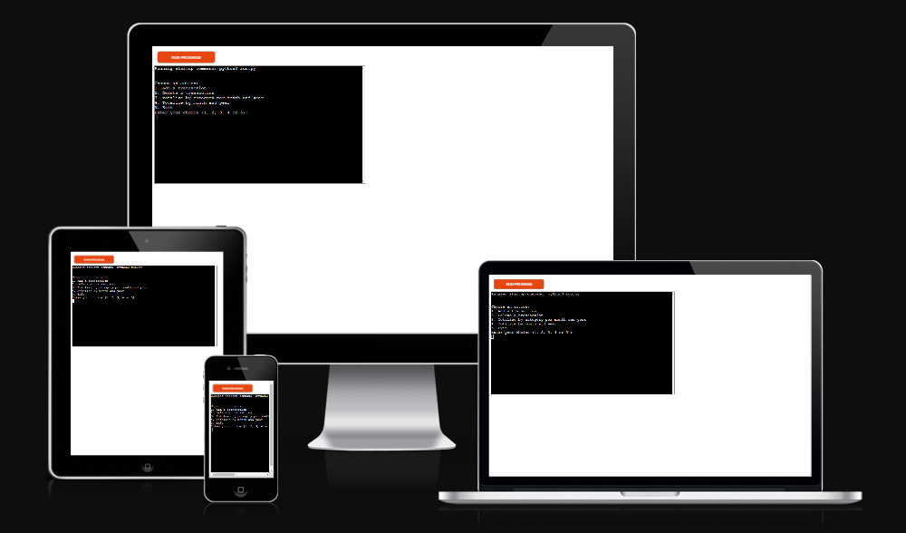

<h1 align="center">Personal Finances Traker</h1>

[View the live project here.](https://personal-finances-tracker-527ecf5f502e.herokuapp.com/)

This Google Sheets finance tracker simplifies personal finance management. Easily log transactions, get automated summaries, and insightful analysis. Enhance budgeting, track expenses, and achieve savings goals for a secure financial future.

<h2 align="center"></h2>

## User Experience (UX)

-   ### User stories

    -   #### First Time Visitor Goals

        1. As a First Time Visitor, I want to keep all my financial transactions in one place.
        2. As a First Time Visitor, I want to easily add, delete and summarize transactions.
        3. As a First Time Visitor, I want to separate transactions by category to be able to track where my money is going.

    -   #### Returning Visitor Goals

        1. As a Returning Visitor, I want to have access to the transactions stored from anywhere with an internet connection.
        2. As a Returning Visitor, I want to be confident that the information is accurate and consistent.
        3. As a Returning Visitor, I want to be able to identify trens and use the information to plan for the future.

    -   #### Frequent User Goals
        1. As a Frequent User, I want easy data access on Google Sheets to simplify my financial analysis.
        2. As a Frequent User, I want access to detailed records of transactions and monthly summaries. 

-   ### Design
    -   #### Colour Scheme
        -   Giving the nature of this project there is not color added.
    -   #### Typography
        -   Giving the nature of this project there is not typography added.
    -   #### Imagery
        -   Giving the nature of this project there is not imagery added.

*   ### Wireframes

    -   Home Page Wireframe - [View](https://github.com/)

    -   Mobile Wireframe - [View](https://github.com/)

## Features

The program is designed to manage personal finances using Google Sheets. It allows the user to to choose from a Main Menu the following actions:

1. Add transactions.
2. Delete transactions.
3. Show the latest 5 transactions on Google Sheets
4. Totalize transactions by category, month, and year.
5. Totalize transactions by month and year.

### Components and Functions

1. Imports and Setup

    - Libraries: The program imports libraries like gspread for Google Sheets interaction, google.oauth2.service_account for authentication, datetime for date manipulation, and re for regular expressions.
    - Scope and Credentials: It defines the scope for Google Sheets and Drive APIs, loads the credentials from a JSON file, and authorizes the client.
    - Google Sheet Connection: The program connects to a specific Google Sheet named 'personal_finances'.

2. Constants and Helpers

    - CATEGORIES: A dictionary mapping short codes to categories like "Expenses", "Investments", etc.
    - Validation Functions:
        - valid_date(): Validates if the input date is in DD/MM/YYYY format and is a valid date.
        - valid_category(): Checks if the input category is valid.
        - valid_amount(): Validates if the input amount is a valid number with up to two decimal places.
        - valid_description(): Ensures the description is not empty.

3. Core Functions

    - get_next_transaction_number(): Determines the next transaction number by finding the maximum existing transaction number in the worksheet and adding 1.
    - add_transactions(): Prompts the user for transaction details, validates the inputs, and appends the transaction to the Google Sheet.
    - delete_transaction(): Deletes a transaction from the Google Sheet based on the transaction number provided by the user.
    - totalize_by_category_month_year(): Calculates the total amount spent by category, month, and year, and stores the results in a separate worksheet called 'category_totals'.
    - totalize_by_month_year(): Calculates the total amount spent by month and year and stores the results in a separate worksheet called 'monthly_totals'.

4. Main Function

    - main(): Provides a menu for the user to choose between adding a transaction, deleting a transaction, show the last 5 stored transactions, totalizing by category/month/year, totalizing by month/year, or exiting the program. It continuously loops until the user decides to exit.

### Detailed Flow

1. Adding a Transaction:
    - The user is prompted to enter the date, category, amount, and description.
    - Each input is validated. If invalid, the user is re-prompted.
    - The program determines the next transaction number.
    - The transaction is added to the 'transactions' worksheet in the Google Sheet.

2. Deleting a Transaction:
    - The user is prompted to enter the transaction number to delete.
    - The program searches for the transaction number and deletes the corresponding row if found.

3. Show last 5 transactions:
    - The program process all the transactions stored in the 'transactions' worksheet and get the last 5.
    - When the program shows the transactions on the console it adds the headers at the top.
    - If the program doesn't find transactions it print the message 'No transactions available.' 

4. Totalizing by Category, Month, and Year:
    - The program processes all transactions and calculates the total amount for each category by month and year.
    - The results are stored in the 'category_totals' worksheet.

5. Totalizing by Month and Year:
    - The program processes all transactions and calculates the total amount for each month and year.
    - The results are stored in the 'monthly_totals' worksheet.

6. Exiting:
    - The user can exit the program by selecting the appropriate menu option.

### Usage

To use this program:

1. Make sure you have the required credentials JSON file (creds.json) for Google Sheets API access.
2. Ensure the 'personal_finances' Google Sheet exists with appropriate worksheets.
3. Run the program and follow the prompts to manage your personal finance transactions.

## Technologies Used

### Languages Used

-   [Python](https://en.wikipedia.org/wiki/Python_(programming_language))

### Frameworks, Libraries & Programs Used

1. [Heroku:](https://www.heroku.com/)
    - Heroku was used to assist with the deployment of the application for the assesment and see the working code in action.
1. [Git](https://git-scm.com/)
    - Git was used for version control by utilizing the Gitpod terminal to commit to Git and Push to GitHub.
1. [GitHub:](https://github.com/)
    - GitHub is used to store the projects code after being pushed from Git.
1. [Google Drive:](https://www.google.com/drive/)
    - Google Drive was used to store in the cloud the spreadsheets and give access to the user with a basic internet conection.
1. [Google Sheets:](https://gmail.google.com/sheets/about/)
    - Google Sheets was used to store the transactions and reports generated by the application.

