<h1 align="center">Personal Finances Traker</h1>

- [View the live project here.](https://personal-finances-tracker-527ecf5f502e.herokuapp.com/)
- [View the Google Sheet here.](https://docs.google.com/spreadsheets/d/1KUZxGqBcDwc4gIKezwP4BvFFIS0X57Xou9l9Y5biMwY/edit?usp=sharing)

This Google Sheets finance tracker simplifies personal finance management. Easily log transactions, get automated summaries, and insightful analysis. Enhance budgeting, track expenses, and achieve savings goals for a secure financial future.

<h2 align="center"></h2>

## User Experience (UX)

-   ### User stories

    -   #### First Time Visitor Goals

        1. As a First Time Visitor, I want to keep all my financial transactions in one place.
        2. As a First Time Visitor, I want to easily add, delete and summarize transactions.
        3. As a First Time Visitor, I want to separate transactions by category to be able to track where my money is going.

    -   #### Returning Visitor Goals

        1. As a Returning Visitor, I want to have access to the transactions stored from anywhere with an internet connection.
        2. As a Returning Visitor, I want to be confident that the information is accurate and consistent.
        3. As a Returning Visitor, I want to be able to identify trens and use the information to plan for the future.

    -   #### Frequent User Goals
        1. As a Frequent User, I want easy data access on Google Sheets to simplify my financial analysis.
        2. As a Frequent User, I want access to detailed records of transactions and monthly summaries. 


-   ### Design
    -   #### Colour Scheme
        -   Giving the nature of this project there is not color added.
    -   #### Typography
        -   Giving the nature of this project there is not typography added.
    -   #### Imagery
        -   Giving the nature of this project there is not imagery added.


*   ### Wireframes

    -   Home Page Wireframe - [View](https://github.com/)

    -   Mobile Wireframe - [View](https://github.com/)


## Features

The program is designed to manage personal finances using Google Sheets. It allows the user to to choose from a Main Menu the following actions:

1. Add transactions.
2. Delete transactions.
3. Show the latest 5 transactions on Google Sheets
4. Totalize transactions by category, month, and year.
5. Totalize transactions by month and year.

### Components and Functions

1. Imports and Setup

    - Libraries: The program imports libraries like gspread for Google Sheets interaction, google.oauth2.service_account for authentication, datetime for date manipulation, and re for regular expressions.
    - Scope and Credentials: It defines the scope for Google Sheets and Drive APIs, loads the credentials from a JSON file, and authorizes the client.
    - Google Sheet Connection: The program connects to a specific Google Sheet named 'personal_finances'.

2. Constants and Helpers

    - CATEGORIES: A dictionary mapping short codes to categories like "Expenses", "Investments", etc.
    - Validation Functions:
        - valid_date(): Validates if the input date is in DD/MM/YYYY format and is a valid date.
        - valid_category(): Checks if the input category is valid.
        - valid_amount(): Validates if the input amount is a valid number with up to two decimal places.
        - valid_description(): Ensures the description is not empty.

3. Core Functions

    - get_next_transaction_number(): Determines the next transaction number by finding the maximum existing transaction number in the worksheet and adding 1.
    - add_transactions(): Prompts the user for transaction details, validates the inputs, and appends the transaction to the Google Sheet.
    - delete_transaction(): Deletes a transaction from the Google Sheet based on the transaction number provided by the user.
    - totalize_by_category_month_year(): Calculates the total amount spent by category, month, and year, and stores the results in a separate worksheet called 'category_totals'.
    - totalize_by_month_year(): Calculates the total amount spent by month and year and stores the results in a separate worksheet called 'monthly_totals'.

4. Main Function

    - main(): Provides a menu for the user to choose between adding a transaction, deleting a transaction, show the last 5 stored transactions, totalizing by category/month/year, totalizing by month/year, or exiting the program. It continuously loops until the user decides to exit.

<h2 align="center">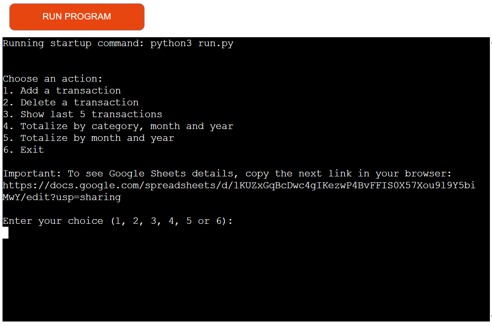</h2>

### Detailed Flow

1. Adding a Transaction:
    - The user is prompted to enter the date, category, amount, and description.
    - Each input is validated. If invalid, the user is re-prompted.
    - The program determines the next transaction number.
    - The transaction is added to the 'transactions' worksheet in the Google Sheet.

<h2 align="center">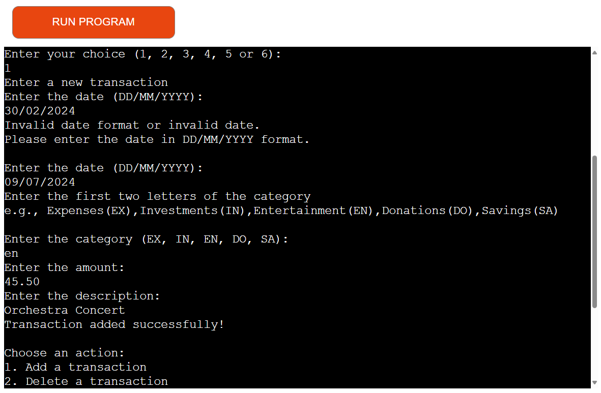</h2>

<h2 align="center">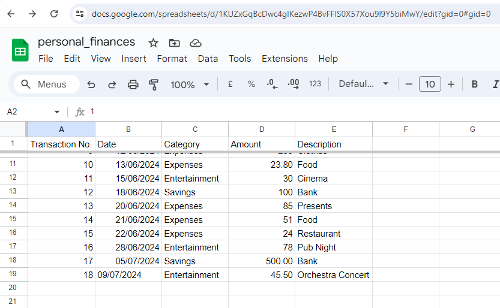</h2>

2. Deleting a Transaction:
    - The user is prompted to enter the transaction number to delete.
    - The program searches for the transaction number and deletes the corresponding row if found.

<h2 align="center">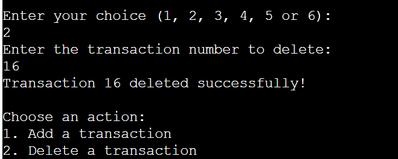</h2>

<h2 align="center">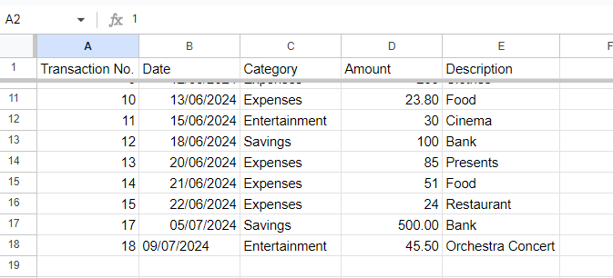</h2>

3. Show last 5 transactions:
    - The program process all the transactions stored in the 'transactions' worksheet and get the last 5.
    - When the program shows the transactions on the console it adds the headers at the top.
    - If the program doesn't find transactions it print the message 'No transactions available.' 

<h2 align="center">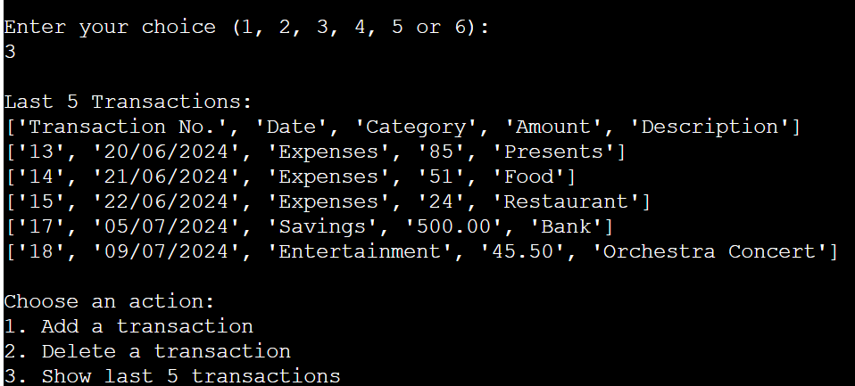</h2>

4. Totalizing by Category, Month, and Year:
    - The program processes all transactions and calculates the total amount for each category by month and year.
    - The results are stored in the 'category_totals' worksheet.

<h2 align="center">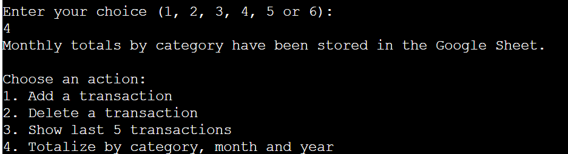</h2>

<h2 align="center">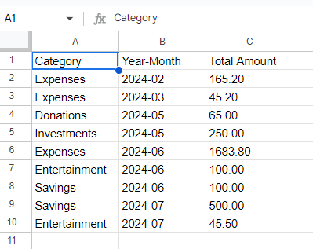</h2>

5. Totalizing by Month and Year:
    - The program processes all transactions and calculates the total amount for each month and year.
    - The results are stored in the 'monthly_totals' worksheet.

<h2 align="center">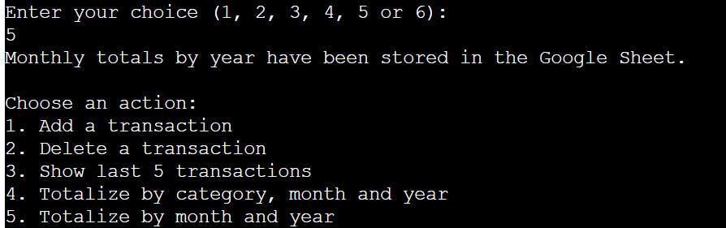</h2>

<h2 align="center">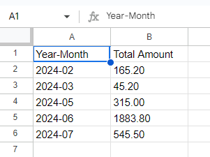</h2>

6. Exiting:
    - The user can exit the program by selecting the appropriate menu option.

<h2 align="center">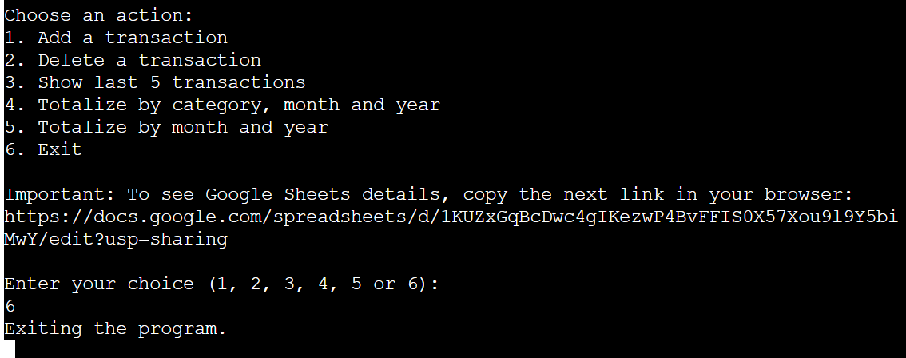</h2>


### Usage

To use this program:

1. Make sure you have the required credentials JSON file (creds.json) for Google Sheets API access.
2. Ensure the 'personal_finances' Google Sheet exists with appropriate worksheets.
3. Run the program and follow the prompts to manage your personal finance transactions.

## Technologies Used

### Languages Used

-   [Python](https://en.wikipedia.org/wiki/Python_(programming_language))

### Frameworks, Libraries & Programs Used

1. [Heroku:](https://www.heroku.com/)
    - Heroku was used to assist with the deployment of the application for the assesment and see the working code in action.
1. [Git](https://git-scm.com/)
    - Git was used for version control by utilizing the Gitpod terminal to commit to Git and Push to GitHub.
1. [GitHub:](https://github.com/)
    - GitHub is used to store the projects code after being pushed from Git.
1. [Google Drive:](https://www.google.com/drive/)
    - Google Drive was used to store in the cloud the spreadsheets and give access to the user with a basic internet conection.
1. [Google Sheets:](https://gmail.google.com/sheets/about/)
    - Google Sheets was used to store the transactions and reports generated by the application.

## Testing

The style checker was used to compare the code against the main conventions recommended for Python in PEP 8 (Style Guide for Python Code) and PEP 257 (Docstring Conventions). Helping with a fine tuning to makes it easy for others to read.

-   [Python 3 Style Checker](https://www.codewof.co.nz/style/python3/)

<h2 align="center">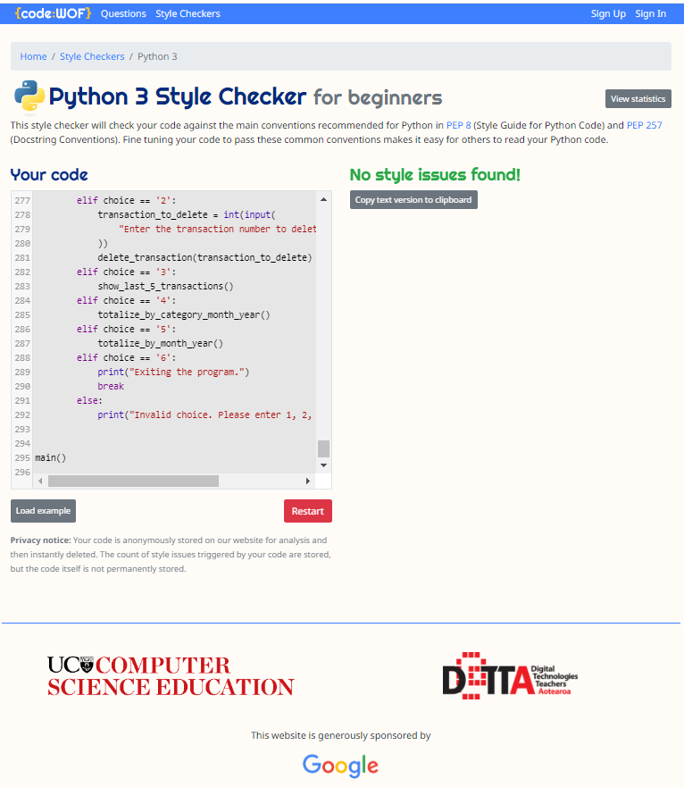</h2>

### Testing User Stories from User Experience (UX) Section

-   #### First Time Visitor Goals

    1. As a First Time Visitor, I want to keep all my financial transactions in one place.

        1. The program allows users to keep track of all their financial transactions in one place on Google Sheets, making it easier to monitor and manage personal finances.

    2. As a First Time Visitor, I want to easily add, delete and summarize transactions.

        1. By automating the process of adding, deleting, and summarizing transactions, the program saves users time and reduces the potential for manual errors.
        2. The program provides a user-friendly interface for entering transactions, ensuring that even those with limited technical skills can manage their finances effectively.

    3. As a First Time Visitor, I want to separate transactions by category to be able to track where my money is going.

        1. The program provides tools to analyze financial data by category, month, and year, giving users insights into their spending and saving patterns.
        2. By categorizing and summarizing transactions, users gain a clearer understanding of where their money is going. This can lead to more informed financial decisions and better budgeting.

-   #### Returning Visitor Goals

    1. As a Returning Visitor, I want to have access to the transactions stored from anywhere with an internet connection.

        1. Storing data in Google Sheets means that it is accessible from anywhere with an internet connection. 
        2. Users can share their financial data with others (e.g., family members, financial advisors) easily.

    2. As a Returning Visitor, I want to be confident that the information is accurate and consistent.

        1. With structured data entry and validation, the program ensures that all financial records are accurate and consistent, which is essential for tracking finances over time.
        2. Users can remove incorrect or unwanted transactions by specifying the transaction number, maintaining the integrity of their financial records.
        3. A series of validations like dates and numbers format, descriptions not empties and predefined categories also help to preserve the records integrity. 

    3. As a Returning Visitor, I want to be able to identify trens and use the information to plan for the future.
        1. By providing totals by category and time period, the program helps users identify trends and plan for future expenses and investments. For example, they can see how much they spend on entertainment each month and adjust their budget accordingly.
        2. By logging all expenses, users can track their spending habits and identify areas where they can cut costs.
        3. Users can monitor their savings over time and make adjustments to reach their savings goals more effectively.
        4. Users can track their investments and assess their financial growth, enabling better investment decisions.

-   #### Frequent User Goals

    1. As a Frequent User, I want easy data access on Google Sheets to simplify my financial analysis.

        1. The application provide access to all the transactions and reports on Google Sheets to facilitate the future user analysis.

    2. As a Frequent User, I want access to detailed records of transactions and monthly summaries. 

        1. Users can see how much they are spending or saving in each category over different time periods, helping them understand their financial habits.
        2. Users can see their overall financial activity for each month and year, helping them track their progress towards financial goals.
        3. Detailed records of transactions are provided for clear understanding of each stored record.

### Further Testing

-   The Aplication was tested on Google Chrome, Internet Explorer, Microsoft Edge and Safari browsers.
-   The app was viewed on a variety of devices such as Desktop, Laptop, iPhone14, Samsung Galaxy S20 & iPhoneXs.
-   A large amount of testing was done to ensure that all the validations were working correctly.
-   Friends and family members were asked to review the site and documentation to point out any bugs and/or user experience issues.

### Known Bugs

-   When the user introduce the category can have many spelling mistakes.
    -   A dictionary to reduce the number of leters writen by the user was implemented and an automatic process writes the full category.
-   The amount of information required to delete a transaction is too long.
    -   A transaction system was implemented to simplify the identification of the transaction to delete.
-   The user wasn't sure if the transaction was added to the list without going to Google Sheets.
    -   A new action was implemented to show the last 5 transactions on the console at any time required by the user.
-   The style wasn't complying 100% with the standars.
    -   A Python Checker was used to identify style issues and they were corrected.

## Deployment

### GitHub Pages

The project was deployed to Heroku using the following steps...

1. Log in to GitHub and locate the [GitHub Repository](https://github.com/)
2. Open the workspace using the IDE [GitPod](https://www.gitpod.io/)
3. Ensure to add a new line caracter at the end of the text of each input method.
4. Create a list of requirements on the requirements.txt file to run the project and install the dependencies in Heroku using the command pip3 freeze > requirements.txt
5. Commit and push the changes to Github.
6. Sign up and create a Heroku account [Heroku](https://www.heroku.com/)
7. I you are a student you can activate an Student Pack and Eco dynos subscription.
8. Create a new app and give an App Name and Location in the form.
9. Go to the app settings and in the Config Vars section give access to the creds.json file and PORT 8000
10. Go to Buildpacks and add the dependencies heroku/python and heroku/nodejs
11. Go to the Deploy section and choose the deployment method Github and connect to Github.
12. Search for the Gitrepository name and connect the Heroku app to the Github repository code.
13. Enable Automatic Deploys
14. Finally you can see a view button with the access to the deployed link and run the program on the web.

 
### Forking the GitHub Repository

By forking the GitHub Repository we make a copy of the original repository on our GitHub account to view and/or make changes without affecting the original repository by using the following steps...

1. Log in to GitHub and locate the [GitHub Repository](https://github.com/)
2. At the top of the Repository (not top of page) just above the "Settings" Button on the menu, locate the "Fork" Button.
3. You should now have a copy of the original repository in your GitHub account.

### Making a Local Clone

1. Log in to GitHub and locate the [GitHub Repository](https://github.com/)
2. Under the repository name, click "Clone or download".
3. To clone the repository using HTTPS, under "Clone with HTTPS", copy the link.
4. Open Git Bash
5. Change the current working directory to the location where you want the cloned directory to be made.
6. Type `git clone`, and then paste the URL you copied in Step 3.

```
$ git clone https://github.com/YOUR-USERNAME/YOUR-REPOSITORY
```

7. Press Enter. Your local clone will be created.

```
$ git clone https://github.com/YOUR-USERNAME/YOUR-REPOSITORY
> Cloning into `CI-Clone`...
> remote: Counting objects: 10, done.
> remote: Compressing objects: 100% (8/8), done.
> remove: Total 10 (delta 1), reused 10 (delta 1)
> Unpacking objects: 100% (10/10), done.
```

Click [Here](https://help.github.com/en/github/creating-cloning-and-archiving-repositories/cloning-a-repository#cloning-a-repository-to-github-desktop) to retrieve pictures for some of the buttons and more detailed explanations of the above process.

## Credits

### Code

-   The program imports libraries like:
        [gspread](https://docs.gspread.org/en/latest/) for Google Sheets interaction, 
        [google.oauth2.service_account](https://developers.google.com/identity/protocols/oauth2) for authentication, 
        [datetime](https://docs.python.org/3/library/datetime.html) for date manipulation, 
        [re](https://docs.python.org/3/library/re.html) for regular expressions.

-   The code to create the credentials and the API connection with Google Drive and Google Sheets was built using the Love Sandwich Project from the Full Stack Developer Course of Code Institute lessons.

-   Instructions to get and write data from Google Sheets [Worksheet_module](https://openpyxl.readthedocs.io/en/stable/api/openpyxl.worksheet.worksheet.html)

### Content

-   All content was written by the developer.

### Media

-   All Images were created by the developer.

### Acknowledgements

-   My Mentor for continuous helpful feedback.

-   Tutor support at Code Institute for their support.